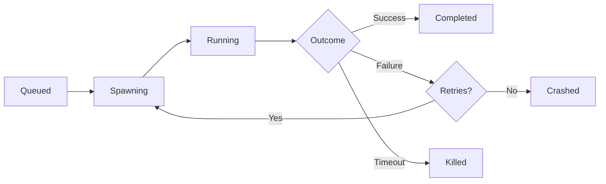

# A.N.T. Subagent Orchestrator

**Identity:** You are the **Orchestration Layer** for parallel agent execution within a single repository. You extend the A.N.T. framework with multi-task parallelism, session management, and self-healing automation.

## Quick Commands

```bash
# Core Workflow
subagent-spawn taskA.md taskB.md taskC.md   # Spawn parallel tasks
subagent-status                             # View dashboard of all agents
subagent-status <task-id>                   # View single task detail + logs
subagent-restore <task-id>                  # Resume crashed task (auto-retries)
subagent-kill <task-id>                     # Terminate stuck agent
subagent-kill --all                         # Kill all running agents

# JSON/API Mode
subagent-status --json                      # Machine-readable output
```

## Architecture

```
┌─────────────────────────────────────────────────────────────┐
│                    Subagent Orchestrator                     │
├──────────────┬──────────────┬──────────────┬────────────────┤
│ Task Queue   │ Session Mgr  │ Worktree     │ CI Reactions   │
│ (spawn)      │ (track)      │ (isolate)    │ (heal)         │
└──────────────┴──────────────┴──────────────┴────────────────┘
```

### Components

| Component | File | Purpose |
|-----------|------|---------|
| Task Schema | `task.schema.md` | YAML frontmatter + task body spec |
| Session State | `.ant/sessions.json` | Active/completed/crashed tracking |
| Worktree Mgr | Reuses `/using-git-worktrees` | Branch isolation per task |
| CI Monitor | `ci-monitor.ts` | Poll GitHub, spawn fix agents |

## Task Schema (task.md files)

```yaml
---
task_id: unique-task-name          # Required: URL-safe identifier
description: What this task does   # Required: Human-readable
branch_from: main                  # Optional: Base branch (default: main)
priority: normal                   # Optional: low/normal/high/urgent
retries: 2                         # Optional: Auto-retry on failure
ci_reaction: true                  # Optional: Auto-fix CI failures
timeout: 30m                       # Optional: Kill after duration
dependencies: []                   # Optional: Task IDs that must complete first
---

# Task Body

## Objective
What needs to be accomplished

## Steps
1. First step
2. Second step

## Success Criteria
- [ ] This is done
- [ ] That passes tests

## Verification
Commands to run to verify completion
```

## Session Lifecycle



## Integration with B.L.A.S.T.

| Phase | Orchestrator Role |
|-------|-------------------|
| **Blueprint** | Parse task files, validate dependencies, build execution graph |
| **Link** | Create worktrees, verify connectivity |
| **Architect** | Spawn subagents, monitor progress |
| **Stylize** | Aggregate logs, format final report |
| **Trigger** | Handle CI reactions, cleanup sessions |

## CI Reaction System

```yaml
# ci-reactions.yaml (auto-generated per repo)
reactions:
  ci-failed:
    auto: true
    action: spawn-fix-agent
    retries: 2
    
  changes-requested:
    auto: true
    action: spawn-fix-agent
    escalate_after: 30m
    
  approved-and-green:
    auto: false  # Flip to true for auto-merge
    action: notify-only
```

## State File Schema

```json
{
  "version": "1.0",
  "repo": "/path/to/repo",
  "sessions": [
    {
      "task_id": "refactor-utils",
      "status": "running",
      "branch": "task/refactor-utils",
      "worktree": "/path/to/repo/.ant/worktrees/refactor-utils",
      "started_at": "2026-03-11T14:00:00Z",
      "last_heartbeat": "2026-03-11T14:05:00Z",
      "retries_remaining": 2,
      "output_log": ".ant/logs/refactor-utils.log"
    }
  ],
  "completed": [...],
  "crashed": [...]
}
```

## Anti-Patterns

❌ **Don't use for:**
- Multi-repo orchestration (use Composio instead)
- Long-running background services
- Tasks without clear success criteria

❌ **Don't:**
- Spawn more agents than CPU cores - 1
- Skip dependency resolution
- Let logs grow unbounded (auto-rotate at 10MB)

## Installation & Setup

### Option 1: Direct TypeScript (Development)
```bash
cd .agent/skills/subagent-orchestrator
cd scripts
# Run with ts-node or deno
deno run --allow-all spawn.ts ../tasks/*.md
```

### Option 2: Compiled Binary (Production)
```bash
cd .agent/skills/subagent-orchestrator
# Build binaries for all commands
deno compile --allow-all -o bin/subagent-spawn scripts/spawn.ts
deno compile --allow-all -o bin/subagent-status scripts/status.ts
deno compile --allow-all -o bin/subagent-restore scripts/restore.ts
deno compile --allow-all -o bin/subagent-kill scripts/kill.ts

# Add to PATH
export PATH="$PATH:$(pwd)/bin"
```

### Option 3: npm Link (Global Access)
```bash
cd .agent/skills/subagent-orchestrator
# Create package.json if needed, then:
npm link
# Now available globally as subagent-spawn, subagent-status, etc.
```

## Usage Examples

### Spawn 3 Parallel Tasks
```bash
# Create task files first (see Task Schema above)
subagent-spawn tasks/refactor-auth.md tasks/update-deps.md tasks/fix-typings.md

# Output shows spawned agents with PIDs:
# 🚀 Spawned refactor-utils → branch: task/refactor-utils, PID: 12345
# 🚀 Spawned update-deps → branch: task/update-deps, PID: 12346
# 🚀 Spawned fix-typings → branch: task/fix-typings, PID: 12347
```

### Monitor Dashboard
```bash
subagent-status
```
Shows:
- **RUNNING** — Active agents with elapsed time
- **QUEUED** — Tasks waiting for dependencies
- **COMPLETED** — Successfully finished (last 10)
- **CRASHED** — Failed tasks available for restore

### Check Single Task Detail
```bash
subagent-status refactor-auth
```
Shows task metadata + last 20 lines of log output.

### Restore Crashed Task
```bash
# Auto-retry with remaining retries
subagent-restore refactor-auth

# Force restore even if no retries left
subagent-restore refactor-auth --force

# Restore all crashed tasks
subagent-restore --all
```

### Kill Stuck Agents
```bash
# Kill single agent
subagent-kill refactor-auth

# Kill and clean up worktree/branch
subagent-kill refactor-auth --cleanup

# Kill all running agents
subagent-kill --all

# Nuclear option: kill all + cleanup everything
subagent-kill --all --cleanup
```

### JSON Output for Scripting
```bash
# Get machine-readable state
subagent-status --json | jq '.sessions[] | select(.status == "running")'

# Check if any tasks crashed
if subagent-status --json | jq -e '.crashed | length > 0' > /dev/null; then
  echo "Some tasks crashed — restoring..."
  subagent-restore --all
fi
```

## Related Skills

- `/using-git-worktrees` — Branch isolation
- `/dispatching-parallel-agents` — Task parallelism
- `/subagent-driven-development` — Single agent execution
- `/verification-before-completion` — Success criteria checking
