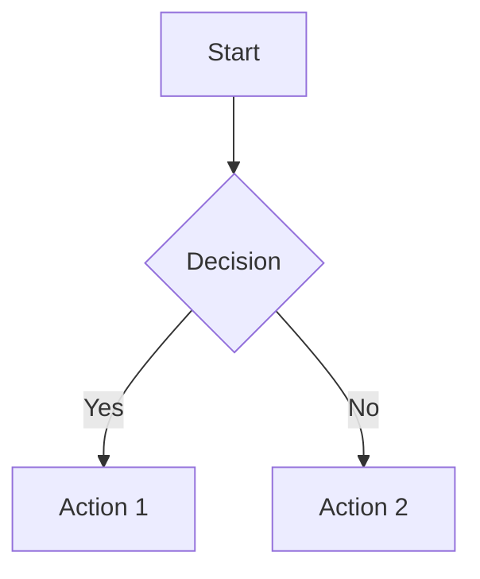

# MEMORY.md - Permanent Context

## Core Principles

### Always Follow Obsidian Conventions

When creating any `.md` files, **always** follow Obsidian best practices to maximize compatibility with Obsidian's features ( backlinks, graph view, queries, etc.).

---

## Obsidian Markdown Standards

### 1. Frontmatter (YAML)

**Always include YAML frontmatter** at the top of notes:

```yaml
---
title: Note Title
date: 2026-03-08
tags: [project, coding, ffxiv]
aliases: [Alternative Name, Short Name]
---
```

**Common frontmatter fields:**
- `title` - Human-readable title
- `date` - Creation date (YYYY-MM-DD)
- `modified` - Last modified date
- `tags` - Array of tags
- `aliases` - Alternative names for linking
- `project` - Associated project
- `status` - draft/in-progress/complete
- `priority` - high/medium/low

### 2. Wikilinks (Preferred)

**Use wikilinks** `[[ ]]` instead of standard markdown links:

```markdown
Good:  [[ActionStacksEX/SUMMARY]]
Good:  [[ActionStacksEX/SUMMARY|Custom display text]]
Good:  [[2026-03-08#Section Header]]

Avoid: [ActionStacksEX SUMMARY](ActionStacksEX/SUMMARY.md)
```

**Link formats:**
- `[[filename]]` - Link to note
- `[[filename|Display Text]]` - Link with custom text
- `[[filename#Header]]` - Link to header
- `[[filename#^block-id]]` - Link to specific block

### 3. Headers & Structure

**Use proper header hierarchy:**

```markdown
# H1 - Main Title (only one per file)

## H2 - Major Sections

### H3 - Subsections

#### H4 - Details (use sparingly)
```

**Obsidian features enabled by headers:**
- Outline view
- Header linking `[[Note#Header]]`
- Folding

### 4. Tags

**Use inline tags** for discoverability:

```markdown
#project #coding #ffxiv #daily-notes

Or in frontmatter:
---
tags: [project, coding, ffxiv]
---
```

**Tag conventions:**
- Use lowercase with hyphens: `#daily-notes` not `#Daily Notes`
- Nest tags: `#status/active`, `#status/archived`
- Common tags: `#todo`, `#idea`, `#bug`, `#feature`, `#docs`

### 5. Dataview Queries

**Format data for Dataview plugin** (if user has it):

```markdown
---
type: project
status: active
date: 2026-03-08
---

Query example:
```dataview
TABLE status, date
FROM #project
WHERE status = "active"
SORT date DESC
```
```

### 6. Callouts

**Use Obsidian callouts** for important information:

```markdown
> [!info] Title
> Information callout

> [!warning] Warning
> Warning callout

> [!tip] Tip
> Helpful tip

> [!note] Note
> General note

> [!todo] Todo
> Action item
```

### 7. Tables

**Format tables properly** for readability:

```markdown
| Column 1 | Column 2 | Column 3 |
|----------|----------|----------|
| Data 1   | Data 2   | Data 3   |
| Data 4   | Data 5   | Data 6   |
```

### 8. Mermaid Diagrams

**Use mermaid** for visual diagrams:

```markdown

```

### 9. Code Blocks

**Always specify language** for syntax highlighting:

```markdown
```csharp
// C# code here
```

```powershell
# PowerShell here
```

```yaml
# YAML frontmatter
```
```

### 10. Block IDs

**Add block IDs** for precise linking:

```markdown
Some important text. ^block-id

Reference it: [[Note#^block-id]]
```

---

## File Organization

### Folder Structure

```
Obsidian/
├── 00-Inbox/           # Temporary notes
├── 01-Projects/        # Active projects
│   └── ProjectName/
│       ├── SUMMARY.md
│       ├── Daily/
│       └── Notes/
├── 02-Areas/           # Ongoing responsibilities
├── 03-Resources/       # Reference material
├── 04-Archive/         # Completed/inactive
├── Daily-Notes/        # Daily activity logs
├── Templates/          # Note templates
└── Workflows/          # Automation scripts
```

### Naming Conventions

**Files:**
- Use PascalCase for project names: `ActionStacksEX.md`
- Use kebab-case for other files: `daily-notes.md`
- Dates: `YYYY-MM-DD.md` for daily notes
- Avoid spaces in filenames (use hyphens)

**Folders:**
- Prefix with numbers for sorting: `00-Inbox`, `01-Projects`
- Use PascalCase for project folders

---

## Linking Strategy

### Create a Web of Knowledge

**Always add backlinks:**
- When mentioning another project, link to it
- When referencing a date, link to daily note
- When listing related topics, link to them

**Example:**
```markdown
Today I worked on [[ActionStacksEX/SUMMARY|ActionStacksEX]], 
a plugin for [[FFXIV]]. See also [[Daily-Notes/2026-03-08]].
```

### Maps of Content (MOCs)

**Create index notes** for major areas:

```markdown
# Projects MOC

## Active
- [[ActionStacksEX/SUMMARY|ActionStacksEX]] - FFXIV plugin
- [[ParseLord3/SUMMARY|ParseLord3]] - Rotation solver
- [[VoiceMaster/SUMMARY|VoiceMaster]] - TTS plugin

## Archive
- [[Old-Project]]
```

---

## Templates

### Daily Note Template

```yaml
---
date: {{date}}
day: {{day}}
tags: [daily-note]
---

# {{date}}

## 🌅 Morning
- 

## 📝 Work Log
- 

## 💭 Thoughts
- 

## 🔗 Links
- [[{{yesterday}}|Yesterday]]
- [[{{tomorrow}}|Tomorrow]]
```

### Project Summary Template

```yaml
---
title: Project Name
date: {{date}}
tags: [project]
status: active
---

# Project Name

## 📋 Overview
Brief description

## 🎯 Goals
- [ ] Goal 1
- [ ] Goal 2

## 📝 Notes
- [[Related Note]]

## 🔗 Links
- GitHub: [repo](url)
- Docs: [[Docs]]
```

---

## Quick Reference

### Do's ✅
- Use YAML frontmatter
- Link liberally with `[[ ]]`
- Add tags for discoverability
- Use callouts for important info
- Specify code block languages
- Create MOCs for organization

### Don'ts ❌
- Don't use spaces in filenames
- Don't leave empty frontmatter fields
- Don't use standard markdown links when wikilinks work
- Don't forget to link related notes
- Don't use H1 headers multiple times

---

## Tools Integration

### Plugins to Consider
- **Dataview** - Query and display note metadata
- **Templater** - Advanced templating
- **Git** - Version control
- **Daily Notes** - Automatic daily note creation
- **Graph View** - Visualize connections

### Automation
- Use `Generate-DailyNotes.ps1` for activity tracking
- Schedule with Task Scheduler for automation

---

*This memory file ensures all markdown files I create are Obsidian-optimized.*
*Last updated: March 2026*
